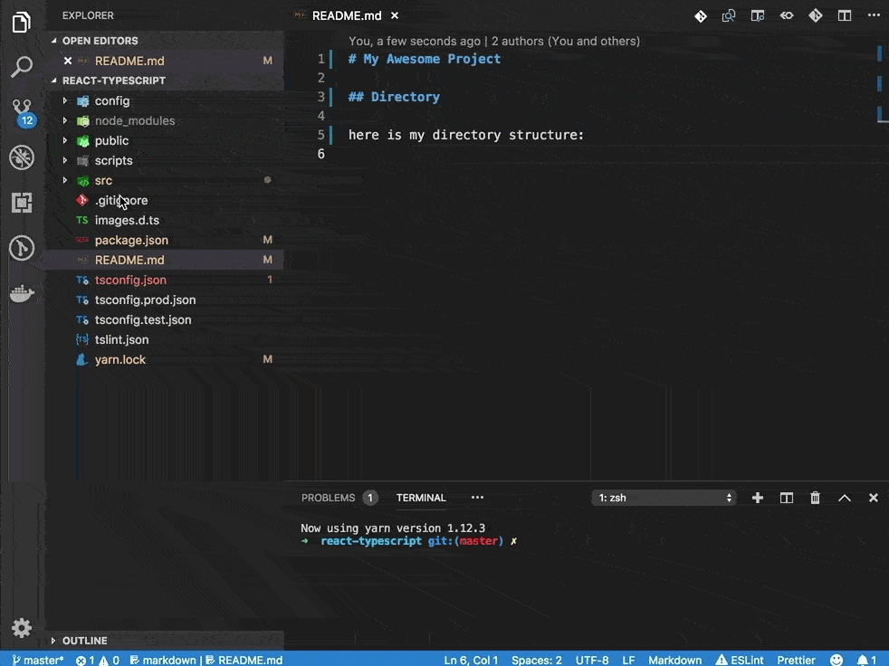

# [ascii tree generator](https://marketplace.visualstudio.com/items?itemName=aprilandjan.ascii-tree-generator)

[](https://dev.azure.com/merlinye/ascii-tree-generator/_build/latest?definitionId=1?branchName=master)
[](https://marketplace.visualstudio.com/items?itemName=aprilandjan.ascii-tree-generator)
[](https://marketplace.visualstudio.com/items?itemName=aprilandjan.ascii-tree-generator)

A VS Code extension to generate ascii tree of directories or format selected text to tree strings.

## Usage

This extension provides convenient way to generate ascii tree strings for directory in workspace explorer. Besides, you can select text in editor and format it to tree strings easily.

### Format Text to Tree Strings

Write simple tree lines in certain syntax (see example below), select these lines, right-click on text and click `Format Text to Tree Strings` menu:


The following kinds of line syntax is supported to correctly format to tree strings:

- lines started with `indent(space or tab)` characters:

  ```
  public
  dist
    index.d.ts
    index.js
  src
    index.ts
  ```

- line started with `hash(#)` symbol

  ```
  # public
  # dist
  ## index.d.ts
  ## index.js
  # src
  ## index.ts
  ```

They should be formatted to:

```
.
├── public
├── dist
│   ├── index.d.ts
│   └── index.js
└── src
    └── index.ts
```

**Note**: In most cases, you can just simply undo the formatting operation using the vscode editor `undo` ability. The default shortcut is <kbd>cmd</kbd>+<kbd>Z</kbd>. Besides,
You can open the VS Code `Command Palette` and execute `Revert Tree Strings to Text` to revert tree strings back to hash-style texts, in case that your undo history is lost for some reason.

### Generate Tree Strings for Directory

Right-click on `Explorer` directories, click `Generate Tree Strings for Directory` menu:



**Note**: This process of walking through files is asynchronous. So if you include some heavy-nested folders, `node_modules` for example, the result will be slow to show.

## Configuration

Each character of the tree can be defined by its ASCII code (or UTF character code in general). The theoretical range for character codes is 0 to 65535. However, not every code will lead to a printable character and may cause formatting problems.
The available parameters are:

| Name | Default Char Code | Default  Character   | Description     |
| -----------------------------| ---- | --------  | --------------- |
| Blank element character code  | 32   | '&#32;'   | For blanks / spaces |
| Child element character code  | 9500 | '&#9500;' | For intermediate child elements |
| Dash element character code   | 9472 | '&#9472;' | For horizontal dashes |
| Last element character code   | 9492 | '&#9492;' | For the last element of a path |
| Parent element character code | 9474 | '&#9474;' | For vertical parent elements |
| Root element character code   | 46   | '&#46;'   | For the root element (on top) |


### Sample Configurations

| Configuration     | Blank      | Child          | Dash           | Last           | Parent         | Root           |
| ----------------- | ---------- | -------------- | -------------- | -------------- | -------------- | -------------- |
| Default           | 32 (&#32;) | 9500 (&#9500;) | 9472 (&#9472;) | 9492 (&#9492;) | 9474 (&#9474;) | 46 (&#46;)     |
| Double Line       | 32 (&#32;) | 9568 (&#9568;) | 9552 (&#9552;) | 9562 (&#9562;) | 9553 (&#9553;) | 9559 (&#9559;) |
| Classic           | 32 (&#32;) | 124 (&#124;)   | 45 (&#45;)     | 43 (&#43;)     | 124 (&#124;)   | 43 (&#43;)     |
| Classic Rounded   | 32 (&#32;) | 124 (&#124;)   | 45 (&#45;)     | 96 (&#96;)     | 124 (&#124;)   | 46 (&#43;)     |
| Exclamation Marks | 32 (&#32;) | 35 (&#35;)     | 61 (&#61;)     | 42 (&#42;)     | 33 (&#33;)     | 35 (&#35;)     |

## Issues & Contribution

Please feel free to submit issues if you have any questions. Contribution is also welcomed :)
